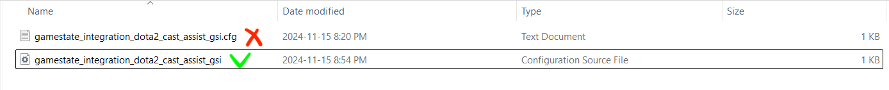

<a id="readme-top"></a>

[![MIT License][license-shield]][license-url]
[![LinkedIn][linkedin-shield]][linkedin-url]
 

<!-- PROJECT LOGO -->
<br />
<div align="center">
  <a href="https://github.com/data-mission/dota2-cast-assist">
    
  </a>
  <div style="text-align: right;">
    <sub><i>Generated by <a href="https://chatgpt.com/"target="_blank">ChatGPT</a></i></sub>
  </div>

  <h3 align="center">Dota2-Cast-Assist</h3>

  <p align="center">
    Fully deployed service with no need to code or run anything locally
  <p align="center">
    Connects you directly to Dota 2 GSI from your browser, offering real-time stats and Steam API integration with minimal setup
    <br />
    <br />
    <a href="https://github.com/data-mission/dota2-cast-assist/issues/new?labels=bug&template=bug-report.md">Report Bug</a>
    ·
    <a href="https://github.com/data-mission/dota2-cast-assist/issues/new?labels=enhancement&template=feature-request.md">Request Feature</a>
  </p>
</div>


## About

Unlock the ultimate tool for Dota 2 broadcasters and spectators. This 
service delivers real-time game insights with zero hassle. By seamlessly 
converting raw GSI (Game State Integration) events into a ready-to-use 
format and enhancing them with live match data from the Steam API, it 
provides aggregated snapshots of game statistics through a powerful REST API. 
Elevate your broadcasts, captivate your audience, and simplify game data 
integration—all in one scalable solution designed for real-time performance.

### How It Works
You'll need [Steam](https://store.steampowered.com/) 
and [Dota2](https://store.steampowered.com/app/570/Dota_2/) installed. The 
service leverages *Game State Integration (GSI)*, a feature Valve integrates 
into its games to enable real-time event tracking. While the official 
documentation references **Counter-Strike**, the same functionality applies to 
**Dota 2**: 

[![CS][cs]][cs-url]


Once a special textual configuration file 
is placed in the required folder on your system, the service begins 
monitoring **Dota 2** events in real time.

When you start watching a game in **Dota 2**, the service captures the live 
match data, processes it, and makes the current game statistics available 
through a REST API. By specifying a unique token, the service generates a 
dedicated page displaying aggregated game stats for easy access in a browser.

## Usage
It’s never been easier as no installations or cloning needed.

All it takes is a quick setup with a text file, and you only need to do it 
once on the PC or laptop where you usually watch Dota 2 matches.

> 🛡 The file creation process is predefined by Valve, does not modify existing 
> files on your laptop or PC, and is entirely secure

Follow these detailed instructions to complete the turn-key setup:

1. You will need to generate your personal spectator's UUID (unique identifier).
Go to a [UUID Generator](https://www.uuidgenerator.net/version4) and keep it 
   open. Below, we will need to copy a Version 4 UUID automatically 
   generated for you. It's a 32-character hexadecimal string in this format, 
   referred to as the `token`:
   ```text
    xxxxxxxx-xxxx-xxxx-xxxx-xxxxxxxxxxxx
    ```

2. You will need to navigate to this folder:
- on **Windows** use **File Explorer**:  
  `📁 C:\Program Files (x86)\Steam\steamapps\common\dota2 beta\game\dota\cfg`


- on **Mac** use **Finder**:  
  `📁 /Users/<your_user>/Library/Application 
Support/Steam/steamapps/common/dota 2 beta/game/dota/cfg`

Some folders may be _**hidden**_, so use these hotkeys to make them visible:
- on **Windows**, in **File Explorer**: Since there is no hotkey, please 
  follow [these instructions](https://support.microsoft.com/en-us/windows/show-hidden-files-0320fe58-0117-fd59-6851-9b7f9840fdb2)


- on **Mac**, in **Finder**: press `Command + Shift + .`

3. In that folder, create a new one named:  
`📁 gamestate_integration`
> ❗ It's important to use only this specific name for the new folder, as GSI 
> will not work otherwise

4. Next, create a new text file named 
`📄 gamestate_integration_dota2_cast_assist_gsi.cfg` in the `📁 gamestate_integration` folder:
- on **Windows**: Open Notepad, create a new file, click "Save As", and in the 
   Save As dialog, choose `All files (*.*)` for "Save as type" field. In the 
  "File name" field, specify `📄 gamestate_integration_dota2_cast_assist_gsi.cfg`. 
  Make sure to select the `📁 gamestate_integration` folder as the save 
  location, 
  then click "Save";


- on **Mac**: Open a text editor, create a new text file, and save it in the 
  `📁 gamestate_integration` folder as `📄 gamestate_integration_dota2_cast_assist_gsi.cfg`.

> ❗Windows users:  
> DO NOT CREATE THE FILE BY RIGHT-CLICKING IN FILE EXPLORER, 
> as an additional extension `*.cfg.txt` will be added to the file, and the 
> Dota 2 GSI server will not recognize it:
> 


> ℹ️  If you want to name the file differently, use this format for the name: 
   `gamestate_integration_<your_name_split-by-hyphens-or_underscores>.cfg`

5. Save this content into the file:
```text
"dota2-gsi Configuration"
{
    "uri"               "https://back-scratcher.scrapingmartians.com/dota2-gsi/dota2-event"
    "timeout"           "5.0"
    "buffer"            "0.1"
    "throttle"          "0.1"
    "heartbeat"         "30.0"
    "data"
    {
        "buildings"     "1"
        "provider"      "1"
        "map"           "1"
        "player"        "1"
        "hero"          "1"
        "abilities"     "1"
        "items"         "1"
        "draft"         "1"
        "wearables"     "1"
    }
    "auth"
    {
        "token"         "xxxxxxxx-xxxx-xxxx-xxxx-xxxxxxxxxxxx"
    }
}
```
The only change you need to make is to replace
`xxxxxxxx-xxxx-xxxx-xxxx-xxxxxxxxxxxx` with the UUID you copied from the 
UUID Generator page we left open
> ❗ It's important to keep the UUID in quotes in the file

> 🔐 **Dota2-Cast-Assist** uses HTTPS to ensure secure, encrypted communication 
> with the Dota 2 client for reliable data transmission

6. 💾 Do not forget to save the changes in the file. Everything 
   is now ready to watch matches and get the GSI stats 🖥️
7. Open (or re-launch Dota 2 if it was already open while you were setting 
   up the configuration file) and choose to watch any match of your choice
8. Open a spare browser and enjoy live match stats by visiting:
```text
https://back-scratcher.scrapingmartians.com/dota2-gsi/live-match/stats?token=xxxxxxxx-xxxx-xxxx-xxxx-xxxxxxxxxxxx,
```
where you need to specify the same `token` as in the configuration file.

🎉 DONE! Refresh the page to access the real-time statistics of the game you 
are watching.

This is an example of the [JSON](./app/templates/example_stats.json) the service currently provides.

<p align="right">(<a href="#readme-top">back to top</a>)</p>


## [Developers guide](DEVELOPERS.md)

## [Roadmap](ROADMAP.md)

## [Contributing](CONTRIBUTING.md)


## Built With

The service is built in [Python](https://www.python.org/), deployed on 
[Google Cloud Platform](https://cloud.google.com/), and 
leverages the following frameworks and APIs:

* [![FastAPI][fastapi]][fastapi-url]
* [![Beam][beam]][beam-url]
* [![Kubernetes][k8s]][k8s-url]
* [![Poetry][poetry]][poetry-url]
* [![GHA][gha]][gha-url]
* [![SteamAPI][steamapi]][steamapi-url]


<!-- LICENSE -->
## License

Distributed under the Apache-2.0 License. See [LICENSE](LICENSE) for more 
information.


<!-- CONTACT -->
## Contact

[![Discord][discord]][discord-url]

Project Link: [https://github.com/data-mission/dota2-cast-assist](https://github.com/data-mission/dota2-cast-assist)


<!-- ACKNOWLEDGMENTS -->
## Acknowledgments

* [Best-README-Template](https://github.com/othneildrew/Best-README-Template)
* [Kustomize](https://kustomize.io/)
* [tox](https://tox.wiki/)

<p align="right">(<a href="#readme-top">back to top</a>)</p>


<!-- MARKDOWN LINKS & IMAGES -->
<!-- https://www.markdownguide.org/basic-syntax/#reference-style-links -->
[license-shield]: https://img.shields.io/github/license/data-mission/dota2-cast-assist.svg?style=for-the-badge
[license-url]: https://github.com/data-mission/dota2-cast-assist/blob/main/LICENSE

[linkedin-shield]: https://img.shields.io/badge/-LinkedIn-blue.svg?style=for-the-badge&logo=linkedin&colorB=blue
[linkedin-url]: https://www.linkedin.com/in/ryzhkovvlad

[fastapi]: https://img.shields.io/badge/FastAPI-009688?style=for-the-badge&logo=fastapi&logoColor=white
[fastapi-url]: https://fastapi.tiangolo.com/

[beam]: https://img.shields.io/badge/Apache%20Beam-FFA500?style=for-the-badge&logo=apache&logoColor=FFD700
[beam-url]: https://beam.apache.org/

[k8s]: https://img.shields.io/badge/Kubernetes-326CE5?style=for-the-badge&logo=kubernetes&logoColor=white
[k8s-url]: https://kubernetes.io/

[poetry]: https://img.shields.io/badge/Poetry-60A5FA?style=for-the-badge&logo=poetry&logoColor=white
[poetry-url]: https://python-poetry.org/

[gha]: https://img.shields.io/badge/GitHub%20Actions-2A2A2A?style=for-the-badge&logo=githubactions&logoColor=white
[gha-url]: https://github.com/features/actions

[gcloud]: https://img.shields.io/badge/Google%20Cloud-4285F4?style=for-the-badge&logo=googlecloud&logoColor=white
[gcloud-url]: https://console.cloud.google.com/

[python]: https://img.shields.io/badge/Python-3776AB?style=for-the-badge&logo=python&logoColor=white
[python-url]: https://www.python.org/

[steamapi]: https://img.shields.io/badge/Steam%20API-294172?style=for-the-badge&logo=steam&logoColor=white
[steamapi-url]: https://steamcommunity.com/dev/apikey

[cs]: https://img.shields.io/badge/Counter--Strike%20GSI-000000?style=for-the-badge&logo=counter-strike&logoColor=white
[cs-url]: https://developer.valvesoftware.com/wiki/Counter-Strike:_Global_Offensive_Game_State_Integration

[discord]: https://img.shields.io/badge/Discord-5865F2?style=for-the-badge&logo=discord&logoColor=white
[discord-url]: https://discord.gg/9xCccyGF
